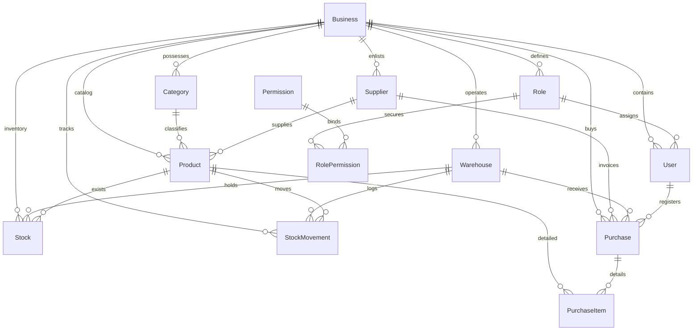

# PRESUERP - AI DEVELOPMENT KIT: DATABASE DOCUMENTATION

Este documento provee la especificación técnica y funcional detallada del diseño físico de la base de datos de **PresuERP**, basado estrictamente en el análisis de `schema.prisma` e infraestructura PostgreSQL asociada.

---

## 1. INTRODUCCIÓN

*   **Objetivo de la Base de Datos**: Servir de motor transaccional robusto y multi-inquilino (multi-tenant) para el ERP, garantizando el aislamiento logístico y relacional de múltiples empresas de forma aislada.
*   **Motor / Proveedor**: PostgreSQL.
*   **ORM**: Prisma Client (`prisma-client-js`).
*   **Convenciones Generales**:
    *   **Nombres de Tablas**: Definidos en minúsculas y pluralizados a nivel físico mediante la directiva `@@map("nombre_tabla")`.
    *   **Claves Primarias (`@id`)**: Enfoque de identificadores mundiales UUID v4 autogenerados: `String @id @default(uuid())`.
    *   **Fechas de Auditoría**: Control de traza inyectado mediante `createdAt DateTime @default(now())` y `updatedAt DateTime @updatedAt`.
    *   **Campos Numéricos y Monetarios**: Decimales de longitud explícita (`Decimal`) para evitar errores financieros de coma flotante.

---

## 2. ARQUITECTURA DEL MODELO DE DATOS

El esquema está diseñado para una topología SaaS modular. Toda entidad transaccional, de catálogo o de configuraciones posee como campo mandatario relacional `businessId` para segregar consistentemente las lecturas relacionales por inquilino.

### Dominios de Negocio
1.  **Core SaaS & Settings**: `businesses`, `business_settings`, `fiscal_settings`, `pos_settings`, `print_settings`, `email_settings`, `number_settings`.
2.  **Seguridad y Accesos (RBAC)**: `users`, `permissions`, `roles`, `role_permissions`, `refresh_tokens`.
3.  **Configuraciones Locales y Folios**: `warehouses`, `payment_methods`, `cash_registers`, `taxes`, `document_types`, `document_series`.
4.  **Catálogo de Inventario**: `categories`, `sub_categories`, `brands`, `suppliers`, `products`, `product_images`, `product_barcodes`, `price_lists`, `price_list_items`.
5.  **Logística y Existencias**: `stocks`, `stock_movements` (Kardex), `warehouse_transfers`, `warehouse_transfer_items`, `inventories`, `inventory_items`.
6.  **Transacciones Comerciales (Compras/Ventas)**: `purchases`, `purchase_items`, `sales`, `sale_items`, `sale_payments`, `cash_sessions`, `cash_movements`, `promotions`, `promotion_items`.
7.  **Soporte**: `favorites`, `attachments`.

---

## 3. ENUMS (TIPOS ENUMERADOS)

*   **Particularidad de Diseño**: El análisis estricto de `schema.prisma` revela que **no existen declaraciones de enums nativos de Prisma** (bloques `enum` físicos en base de datos). 
*   **Implementación**: Los campos que conceptualmente operan como tipos catalogados (tales como estados de comprobantes, tipos de movimientos o roles) se modelan físicamente bajo el formato `String` en PostgreSQL, dotados de defaultings de inicio y gobernados por validaciones lógicas en frontend (Zod) y backend (Services/Validators).

Campos conceptuales tratados como Enums lógicos en la base relacional:
*   `status` en `WarehouseTransfer`: `'PENDING'`, `'IN_TRANSIT'`, `'COMPLETED'`, `'CANCELLED'`.
*   `status` in `Inventory`: `'DRAFT'`, `'SUBMITTED'`, `'CANCELLED'`.
*   `status` in `Product`: `'ACTIVE'`, `'INACTIVE'`, `'DRAFT'`.
*   `status` in `Purchase`: `'DRAFT'`, `'APPROVED'`, `'CANCELLED'`.
*   `paymentStatus` in `Purchase`: `'PENDING'`, `'PARTIAL'`, `'PAID'`.
*   `status` in `Sale`: `'COMPLETED'`, `'DRAFT'`, `'CANCELLED'`, `'REFUNDED'`.
*   `type` in `PaymentMethod`: `'CASH'`, `'CARD'`, `'TRANSFER'`, `'DIGITAL_WALLET'`, `'CREDIT'`.
*   `movementType` in `StockMovement`: `'ENTRY'`, `'EXIT'`, `'TRANSFER_IN'`, `'TRANSFER_OUT'`, `'ADJUSTMENT'`, `'INVENTORY'`.
*   `type` in `CashMovement`: `'IN'`, `'OUT'`.
*   `discountType` in `Promotion`: `'PERCENTAGE'`, `'FIXED_AMOUNT'`, `'BUY_X_GET_Y'`.

---

## 4. MODELOS CENTRALES DE LA BASE DE DATOS

A continuación se documentan con precisión física los modelos definidos en Prisma:

### Model: `Business` (Tabla: `businesses`)
*   **Objetivo**: Representar al inquilino (empresa/tenant) y actuar como el límite primario de aislamiento del modelo SaaS.
*   **Campos**:
    *   `id`: `String` (PK, UUID)
    *   `name`: `String`
    *   `taxId`: `String` (Unique, representa CUIT/RUT/RFC)
    *   `email`, `phone`, `address`: `String?` (Opcionales)
    *   `isActive`: `Boolean` (Default: `true`)
    *   `createdAt`, `updatedAt`: `DateTime`
*   **Índices & Restricciones**: Índice físico sobre `taxId` (Unique) e `isActive`.
*   **Riesgos de Modificación / Integridad**: La remoción o desactivación física de un registro `Business` desencadena cascadas destructivas sobre absolutamente todas las tablas del inquilino asociadas por foreign keys.

### Model: `User` (Tabla: `users`)
*   **Objetivo**: Almacenar los registros de credenciales y vincular usuarios a un negocio y a un rol RBAC.
*   **Campos**:
    *   `id`: `String` (PK, UUID)
    *   `name`: `String`
    *   `email`: `String` (Unique)
    *   `password`: `String` (Hash bcrypt)
    *   `isActive`: `Boolean` (Default: `true`)
    *   `businessId`: `String` (FK a `Business`)
    *   `roleId`: `String` (FK a `Role`)
    *   `createdAt`, `updatedAt`: `DateTime`
*   **Índices**: Índice compuesto `[businessId, email]`.

### Model: `Role` (Tabla: `roles`)
*   **Objetivo**: Definir roles de seguridad parametrizables a nivel de negocio y sistema.
*   **Campos**:
    *   `id`: `String` (PK, UUID)
    *   `name`: `String`
    *   `description`: `String?`
    *   `businessId`: `String` (FK a `Business`)
    *   `isSystem`: `Boolean` (Default: `false`)
    *   `createdAt`, `updatedAt`: `DateTime`
*   **Restricciones**: Clave única compuesta `@@unique([name, businessId])`.

### Model: `Product` (Tabla: `products`)
*   **Objetivo**: Catálogo único de artículos legibles por empresa.
*   **Campos**:
    *   `id`: `String` (PK, UUID)
    *   `name`: `String`
    *   `sku`: `String?` (Unique por negocio)
    *   `barcode`: `String?` (Código de barras)
    *   `description`: `String?`
    *   `categoryId`: `String` (FK a `Category`)
    *   `subCategoryId`: `String?` (FK a `SubCategory`)
    *   `brandId`: `String?` (FK a `Brand`)
    *   `supplierId`: `String?` (FK a `Supplier`)
    *   `status`: `String` (Default: `'ACTIVE'`)
    *   `hasVariations`: `Boolean` (Default: `false`)
    *   `purchasePrice`: `Decimal` (Default: 0.00, costos)
    *   `salePrice`: `Decimal` (Default: 0.00, ventas)
    *   `profitMargin`: `Decimal` (Default: 30.00, margen de ganancia)
    *   `businessId`: `String` (Multi-tenant FK)
    *   `createdAt`, `updatedAt`: `DateTime`
*   **Restricciones**: Clave única `@@unique([sku, businessId])`. Índices sobre `[businessId, status]` y `[barcode, businessId]`.

### Model: `Stock` (Tabla: `stocks`)
*   **Objetivo**: Consolidar en tiempo real el saldo de existencias de un determinado artículo dentro de un almacén.
*   **Campos**:
    *   `id`: `String` (PK)
    *   `businessId`: `String` (FK)
    *   `warehouseId`: `String` (FK a `Warehouse`)
    *   `productId`: `String` (FK a `Product`)
    *   `quantity`: `Decimal` (Default: 0.000)
    *   `reservedQuantity`: `Decimal` (Default: 0.000)
    *   `minimumStock`, `maximumStock`: `Decimal` (Default: 0.000)
    *   `createdAt`, `updatedAt`: `DateTime`
*   **Restricciones**: Clave única compuesta: `@@unique([warehouseId, productId, businessId])`. Índices específicos sobre `productId`, `warehouseId` y `businessId`.

### Model: `StockMovement` (Tabla: `stock_movements`)
*   **Objetivo**: Registro inmutable de transacciones físicas de inventario (Kardex).
*   **Campos**:
    *   `id`: `String` (PK)
    *   `businessId`: `String` (FK)
    *   `warehouseId`: `String` (FK)
    *   `productId`: `String` (FK)
    *   `userId`: `String` (FK a `User`)
    *   `movementType`: `String` (ENTRY, EXIT, TRANSFER, etc.)
    *   `quantity`: `Decimal` (Saldo modificado, ej: negativo para salidas)
    *   `stockBefore`: `Decimal` (Saldo inicial)
    *   `stockAfter`: `Decimal` (Saldo resultante)
    *   `unitCost`: `Decimal` (Costo unitario en compra)
    *   `totalCost`: `Decimal` (Costo extendido)
    *   `referenceType`, `referenceId`, `referenceNumber`: `String?` (Vinculación documental)
    *   `reason`, `notes`: `String?`
    *   `createdAt`, `updatedAt`: `DateTime`
*   **Índices**: `[businessId, productId]`, `[businessId, warehouseId]`, `[businessId, createdAt]`.

### Model: `Purchase` (Tabla: `purchases`)
*   **Objetivo**: Récord maestro físico del comprobante de ingreso de stock (compras).
*   **Campos**:
    *   `id`: `String` (PK)
    *   `businessId`, `supplierId`, `warehouseId`, `userId`: `String` (Foreign keys asignadas)
    *   `purchaseNumber`: `String` (Identificador del comprobante del tenant)
    *   `documentType`: `String` (Default: `'FACTURA'`)
    *   `documentNumber`: `String?`
    *   `status`: `String` (Default: `'DRAFT'`)
    *   `paymentStatus`: `String` (Default: `'PENDING'`)
    *   `purchaseDate`, `expectedDate`: `DateTime`
    *   `subtotal`, `discount`, `tax`, `total`: `Decimal` (Control financiero)
    *   `notes`: `String?`
    *   `hasInvoiceTaxes`: `Boolean` (Default: `false`)
    *   `vatRate`: `Decimal` (Default: 21.00, porcentaje IVA)
    *   `vatAmount`: `Decimal` (Default: 0.00, monto calculado)
    *   `otherTaxes`: `String?` (JSON serializado de impuestos dinámicos)
    *   `invoicedTotal`: `Decimal?` (Total de factura del proveedor)
    *   `createdAt`, `updatedAt`: `DateTime`
*   **Restricciones**: Clave única compuesta `@@unique([purchaseNumber, businessId])`.

---

## 5. RELACIONES CLAVE Y COMPORTAMIENTO REFERENCIAL

Prisma mapea de forma estricta las claves foráneas con políticas de borrado claras.

### Políticas de Borrado en Cascada (`onDelete: Cascade`)
Están configuradas sobre vinculaciones de configuración o estructura de negocio del tenant para evitar datos huérfanos si se elimina la entidad jerárquica padre:
*   `Business` ──(Cascade)──> `BusinessSettings`, `FiscalSettings`, `POSSettings`, `PrintSettings`, `EmailSettings`, `NumberSettings`.
*   `Business` ──(Cascade)──> `roles`, `users`, `categories`, `suppliers`, `warehouses`, `price_lists`, `products`, `stocks`, `purchases`.
*   `Product` ──(Cascade)──> `product_images`, `product_barcodes`, `price_list_items`, `stocks`.
*   `Purchase` ──(Cascade)──> `purchase_items`.

### Restricciones de Integridad (`onDelete: Restrict`)
Protegen los flujos históricos del negocio bloqueando eliminaciones si existen movimientos activos:
*   `Warehouse` ──(Restrict)──> `warehouse_transfers` (como origen o destino), `inventories`, `purchases`, `stock_movements`.
*   `Product` ──(Restrict)──> `warehouse_transfer_items`, `inventory_items`, `purchase_items`, `sale_items`.
*   `User` ──(Restrict)──> `warehouse_transfers`, `inventories`, `purchases`, `sales`, `stock_movements`, `cash_sessions`.
*   `Supplier` ──(Restrict)──> `purchases`.

---

## 6. AISLAMIENTO MULT-TENANT

La seguridad de datos por inquilino opera segregada físicamente a través de la presencia del campo `businessId` (`String`) en los modelos:

```
[ Business (Tenant Master) ]
           │
           ├──> Catálogos (products, categories, price_lists, suppliers) ──> filtran por businessId
           ├──> Almacenes y Depósitos (warehouses, stocks) ───────────────> filtran por businessId
           ├──> Lógica de Sesiones (users, roles, audit_logs) ─────────────> filtran por businessId
           └──> Transaccionales (purchases, sales, stock_movements) ──────> filtran por businessId
```

*   **Garantía**: Toda búsqueda select, insert, update o delete escrita en la capa de datos (`repositories`) incluye el criterio de filtro `{ businessId }`.
*   **Excepción**: Las tablas de catálogo del sistema que definen permisos compartidos (ej. tabla `permissions`) no tienen pertenencia a inquilinos específicos, distribuyéndose globalmente.

---

## 7. AUDITORÍA Y TRAZABILIDAD

El esquema implementa la traza histórica mediante dos columnas temporales nativas:
1.  `createdAt`: Captura la marca de tiempo de creación automática: `DateTime @default(now())`.
2.  `updatedAt`: Actualizado físicamente a nivel del ORM: `DateTime @updatedAt`.
3.  **DeletedAt / Soft Delete**: **No existe** columna `deletedAt` en base de datos. El ERP no utiliza soft delete nativo de base de datos.
    *   *Alternativa implementada (Logical Delete)*: Para el modelo `Product`, se efectúa un cambio de estado lógico (`status = 'INACTIVE'`) a nivel de aplicación cuando existen registros transaccionales activos vinculados en cascada que bloquean su borrado físico.
4.  **ActivityLog (Tabla `activity_logs`)**: Centraliza la auditoría persistiendo serializaciones completas de snapshots anteriores (`previousValues`) y posteriores (`newValues`) en formato `Text` (JSON stringified).

---

## 8. ÍNDICES Y DESEMPEÑO

Para optimizar búsquedas masivas y ordenamiento relacional, `schema.prisma` define índices específicos (`@@index`) sobre campos estructurados:

*   **`audit_logs` / `activity_logs`**: Índices compuestos sobre `[businessId, createdAt]` y `[businessId, module]` para acelerar las cargas del panel de trazabilidad del dashboard.
*   **`stocks`**: Índices individuales sobre `productId`, `warehouseId` y `businessId` para responder con rapidez a inventarios críticos consolidables.
*   **`stock_movements`**: Índices sobre `[businessId, productId]` y `[businessId, warehouseId]`, esenciales para reconstruir el historial del Kardex ordenado en el tiempo.
*   **`products`**: Índice sobre `[barcode, businessId]` para optimizar búsquedas rápidas con lectores de códigos de barra en el POS y recepciones de mercadería.

---

## 9. REGLAS DE INTEGRIDAD REFERENCIAL Y DE NEGOCIO

El esquema Postgres/Prisma restringe operativamente los registros mediante las siguientes validaciones:
*   **Campos obligatorios**: Propiedades como `purchaseId` y `productId` (no opcionales) obligan a que todo desglose de compra esté validado contra su cabecera e ítem del catálogo.
*   **Consistencia Compuesta**: Claves compuestas combinadas como `@@unique([purchaseNumber, businessId])` evitan solapamiento del identificador secuencial de comitentes de distintos tenants en la misma base relacional PostgreSQL.
*   **Relación de Cajas**: Las sesiones de caja (`cash_sessions`) requieren tanto la vinculación de su punto de cobro físico (`cashRegisterId`) como de los usuarios cajeros encargados del inicio y final de su jornada laboral (`openedById`, `closedById`).

---

## 10. DEPENDENCIAS DE TABLAS

Las prioridades en el ciclo de persistencia clasifican las entidades en:

```
[ Tablas de Configuración ] (businesses, business_settings, fiscal_settings, warehouses)
            ↓
  [ Tablas de Catálogo ]    (categories, suppliers, products, price_lists)
            ↓
  [ Tablas Transaccionales ] (purchases, purchase_items, stock_movements, stocks)
```

1.  **Tablas de Configuración**: Deben preexistir activadas para estructurar la lógica del tenant (ej. habilitar depósitos activos antes de operar).
2.  **Tablas de Catálogo**: Fichas maestras estables de artículos cargados bajo control del catálogo.
3.  **Tablas Transaccionales**: Contienen registros históricos de movimientos financieros y físicos que se nutren de la vinculación a depósitos y productos maestros.

---

## 11. FLUJOS DE TRANSACCIÓN FÍSICA

El flujo detallado de la afectación física sobre las tablas en operaciones comerciales responde al siguiente ciclo:

```
                [ Compra: Cabecera y Detalle ]
                (Reg en purchases y purchase_items)
                                 │
                                 ▼
                     [ Compra: Aprobación ]
                     (Status = APPROVED y PAID)
                                 │
           ┌─────────────────────┴─────────────────────┐
           ▼                                           ▼
[ Kardex: stock_movements ]                 [ Existencias: stocks ]
(Inserta línea ENTRY con costeo            (Update a quantity disponible
  y firmas del operador)                       por producto-almacén)
           │                                           │
           └─────────────────────┬─────────────────────┘
                                 ▼
                     [ Log: activity_logs ]
                  (Inserta detalle del movimiento)
```

---

## 12. DIAGRAMA DE RELACIONES GENERAL (MERMAID)



---

## 13. OBSERVACIONES TÉCNICAS

1.  **Omisión del Soft Delete**: Al no poseer un flag nativo físico de borrado lógico tipo `deletedAt`, la eliminación de catálogos y transacciones descansa puramente en la lógica restrictiva del backend. Modificar productos o almacenes vinculados a históricos de stock arrojará excepciones de integridad de Postgres bloqueando el flujo del desarrollo si no se trata previamente de manera lógica en la aplicación.
2.  **Ubicación y Gestión de Decimales**: La conversión explícita en backend de tipos Prisma `Decimal` a tipos primitivos `Number()` previene el arrastre de errores de redondeo en JS, pero impone riesgos de desbalanceo de centavos en la base relacional si los redondeos no se realizan consistentemente.
3.  **JSON a Nivel de Impuestos**: El campo `otherTaxes` en la tabla `purchases` almacena un string serializado estructurado JSON. Esto simplifica la flexibilidad de la gestión impositiva manual frente a tablas hijas impositivas, pero desactiva la posibilidad de realizar agregaciones SQL nativas eficaces sobre impuestos percibidos a menos que se proceda a un parseo programático de base.
