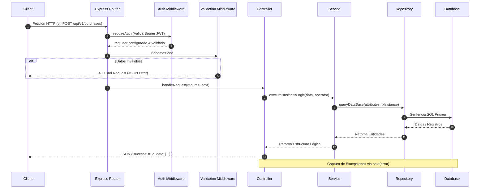

# PRESUERP - AI DEVELOPMENT KIT: BACKEND ARCHITECTURE & SPECIFICATION

Este documento proporciona una especificación técnica de nivel empresarial del **Backend** de **PresuERP**, detallando su infraestructura, ciclo de vida de peticiones, capas de software, control de acceso, persistencia y convenciones de desarrollo de sistemas.

---

## 1. ARQUITECTURA GENERAL E INFRAESTRUCTURA

El backend de PresuERP es una API REST modular impulsada por Node.js, Express y TypeScript, y estructurada bajo principios de Clean Architecture simplificada. Toda la persistencia lógica se delega a PostgreSQL utilizando Prisma ORM.

### Estructura de Capas
El backend divide estrictamente las responsabilidades lógicas en cinco capas desacopladas:

```
[ Capa de Controladores (Request/Response) ]
                     │
                     ▼
[ Capa de Validadores (Zod Schemas) ]
                     │
                     ▼
[ Capa de Servicios de Negocio (Business Logic) ] ── ( Transacciones & Logs )
                     │
                     ▼
[ Capa de Repositorios (Data Access) ]
                     │
                     ▼
[ Base de Datos: PostgreSQL via Prisma Client ]
```

---

## 2. ESTRUCTURA COMPLETA DE CARPETAS Y RESPONSABILIDADES

La carpeta `erp/backend/src` organiza el código según las siguientes responsabilidades lógicas:

*   **`config/`**: Archivos de bootstrap de servicios del núcleo del ERP.
    *   `db.ts`: Instancia del cliente global de Prisma.
    *   `env.ts`: Carga de dotenv y validación en tiempo de compilación del esquema de variables de entorno mediante Zod.
    *   `logger.ts`: Sistema de logs parametrizado vía Winston.
*   **`middlewares/`**: Interceptores de ciclo de vida HTTP.
    *   `auth.middleware.ts`: Autenticación por token Bearer JWT y validación dinámica de accesos (RBAC).
    *   `error.middleware.ts`: Capturador de excepciones y normalizador de respuestas JSON.
    *   `validation.middleware.ts`: Validador de cuerpos de mensaje REST usando esquemas Zod en Express.
*   **`repositories/`**: Abstracciones directas sobre base de datos.
    *   *Responsabilidad:* Interactuar únicamente con Prisma y resolver filtros de comisiones, productos, stock y logs.
*   **`services/`**: Lógica de cálculo, validación empresarial y control de inventario.
    *   *Responsabilidad:* Representa la capa lógica que lanza transacciones del sistema y genera logs de auditoría.
*   **`controllers/`**: Mapeadores de entrada-salida.
    *   *Responsabilidad:* Recuperar variables Web e invocar lógica del negocio.
*   **`routes/`**: Archivos que definen URIs asociando controladores y middlewares.
*   **`validators/`**: Definición de objetos y reglas de estructuración Zod.
*   **`utils/`**: Clases de definición y soporte técnico (como `AppError`).

---

## 3. INICIALIZACIÓN, CONFIGURACIÓN Y VARIABLES DE ENTORNO

### Inicialización (`index.ts` y `app.ts`)
*   `app.ts` instancia la aplicación Express, activa middlewares globales de seguridad (Helmet, Cors, Express JSON limitadores), acopla el hub de rutas bajo el prefijo `/api/v1` y añade el middleware finalizador `errorHandler`.
*   `index.ts` lee la configuración del servidor, inicializa la escucha en el puerto tcp de red configurado y monitoriza cierres ordenados del servidor contra Postgres.

### Esquema y Tipado de Variables (`src/config/env.ts`)
La inicialización aplica un parseo seguro con Zod:
```typescript
const envSchema = z.object({
  NODE_ENV: z.enum(['development', 'production', 'test']).default('development'),
  PORT: z.coerce.number().default(5000),
  DATABASE_URL: z.string().url(),
  JWT_SECRET: z.string().min(8),
  JWT_REFRESH_SECRET: z.string().min(8),
  CORS_ORIGIN: z.string().default('http://localhost:5173'),
});
```

---

## 4. FLUJO DE UNA PETICIÓN HTTP (REQUEST LIFE CYCLE)



---

## 5. MIDDLEWARES PRINCIPALES Y VALIDACIÓN DE DATOS

### Autenticación y RBAC (`auth.middleware.ts`)
1.  **`requireAuth`**: Extrae la cabecera `Authorization`. Decodifica e instrumenta el payload del token verificado en `req.user`.
2.  **`requirePermission(permissionName)`**:
    *   Verifica si el usuario es un superusuario con rol exacto `'Administrator'`.
    *   En caso contrario, comprueba que el string `permissionName` se encuentre contenido en la propiedad `req.user.permissions`.

### Validación Dinámica (`validation.middleware.ts`)
Evita la inyección de tipos inconsistentes:
```typescript
export const validateBody = (schema: AnyZodObject) => {
  return async (req: Request, res: Response, next: NextFunction) => {
    try {
      req.body = await schema.parseAsync(req.body);
      next();
    } catch (error) {
      next(error); // Delega al errorHandler centralizado
    }
  };
};
```

---

## 6. LÓGICA DE DATOS Y MULT-TENANCY

### Aislamiento Multi-Tenant
Toda relación en el backend extrae el tenant del operador:
```typescript
const businessId = req.user.businessId;
// El businessId viaja implícitamente del req.user sin intervención del cliente
const product = await this.productRepo.findById(id, businessId);
```
En el Repositorio:
```typescript
async findById(id: string, businessId: string) {
  return prisma.product.findFirst({
    where: { id, businessId }
  });
}
```

---

## 7. SISTEMA DE TRANSACCIONES Y CONTROL DE ERRORES

### Transacciones Atómicas en Servicios
Cuando un servicio concurre a modificar múltiples tablas, implementa la transacción nativa de Prisma pasando el cliente transaccional `tx` a los repositorios implicados:

*Ejemplo Real (`PurchaseService.approve`)*:
```typescript
async approve(id: string, businessId: string, userId: string) {
  return await prisma.$transaction(async (tx) => {
    // 1. Obtener la compra usando el cliente transaccional
    const purchase = await this.purchaseRepo.findById(id, businessId);
    
    // 2. Modificar el estado físico de la compra
    await tx.purchase.update({
      where: { id },
      data: { status: 'APPROVED', paymentStatus: 'PAID' }
    });

    // 3. Registrar el Kardex de entrada reutilizando tx
    await this.stockMovementService.registerMovement({
      businessId,
      warehouseId: purchase.warehouseId,
      productId: item.productId,
      userId,
      movementType: 'ENTRY',
      quantity: Number(item.quantity)
    }, undefined, undefined, tx); // El objeto tx es mandatario
  });
}
```

### Excepciones Especializadas y AppError
Los fallos lógicos se detienen lanzando excepciones extendidas que el manejador de errores Express traduce a códigos de respuesta estándar (400, 401, 403, 404, 409, 500).

```typescript
export class ConflictError extends AppError {
  constructor(message: string = 'Conflict') {
    super(message, 409);
  }
}
```

---

## 8. GUÍA DE DESARROLLO E INTEGRACIÓN PARA DESARROLLADORES e IAs

### Cómo Agregar un Nuevo Endpoint al Backend

Para expandir la API del backend, se debe seguir exactamente este orden de implementación de 5 pasos:

#### Paso 1: Definir Esquema de Validación Zod
En `src/validators`, cree las restricciones de campos.
```typescript
// src/validators/custom.validator.ts
import { z } from 'zod';
export const createCustomSchema = z.object({
  name: z.string().min(1, 'El nombre es obligatorio'),
  value: z.number().positive('El valor debe ser superior a cero')
});
```

#### Paso 2: Crear el Repositorio de Capa de Datos
En `src/repositories/`, encapsule las queries Prisma previniendo lógica de negocio de centavos.
```typescript
// src/repositories/custom.repository.ts
import { prisma } from '../config/db';
export class CustomRepository {
  async create(data: any, tx?: any) {
    return (tx || prisma).customEntity.create({ data });
  }
  async findById(id: string, businessId: string) {
    return prisma.customEntity.findFirst({ where: { id, businessId } });
  }
}
```

#### Paso 3: Desarrollar la Capa de Servicios
En `src/services/`, implemente cálculos e inyecte los activity logs requeridos.
```typescript
// src/services/custom.service.ts
import { CustomRepository } from '../repositories/custom.repository';
import { ActivityLogRepository } from '../repositories/activityLog.repository';
import { NotFoundError } from '../utils/appError';

export class CustomService {
  private customRepo = new CustomRepository();
  private activityLogRepo = new ActivityLogRepository();

  async create(data: any, operator: any) {
    const result = await this.customRepo.create({
      ...data,
      businessId: operator.businessId
    });

    await this.activityLogRepo.log({
      userId: operator.id,
      businessId: operator.businessId,
      entityName: 'CustomEntity',
      entityId: result.id,
      actionType: 'CREATE',
      newValues: JSON.stringify(result)
    });

    return result;
  }
}
```

#### Paso 4: Escribir el Controlador de Entrada
En `src/controllers/`, mapée el request y responda al cliente.
```typescript
// src/controllers/custom.controller.ts
import { Request, Response, NextFunction } from 'express';
import { CustomService } from '../services/custom.service';

const customService = new CustomService();

export const createCustom = async (req: Request, res: Response, next: NextFunction) => {
  try {
    const operator = req.user; // Definido por el middleware de autenticación
    const data = await customService.create(req.body, operator);
    res.status(201).json({
      success: true,
      data
    });
  } catch (error) {
    next(error);
  }
};
```

#### Paso 5: Mapear la Ruta con Middlewares de Seguridad
En `src/routes/`, ensamble la ruta asociando los filtros JWT y Zod.
```typescript
// src/routes/custom.routes.ts
import { Router } from 'express';
import { createCustom } from '../controllers/custom.controller';
import { validateBody } from '../middlewares/validation.middleware';
import { createCustomSchema } from '../validators/custom.validator';
import { requirePermission } from '../middlewares/auth.middleware';

const router = Router();

router.post(
  '/',
  requirePermission('custom:create'),
  validateBody(createCustomSchema),
  createCustom
);

export default router;
```
*No olvide incorporar la ruta de vinculación dentro del archivo hub general `/src/routes/index.ts`.*

---

## 9. OBSERVACIONES TÉCNICAS Y RIESGOS

1.  **Redacción de Snapshots de Auditoría**: La serialización en `activity_logs` mediante strings no valida omisiones. Si la base de datos crece exponencialmente, persistir JSON stringificados pesados en base de datos tipo `Text` puede afectar la carga del Dashboard si no se parametriza paginación detallada.
2.  **Validaciones de Roles en Express vs Frontend**: El middleware backend `/requireRole/` y `/requirePermission/` otorga bypass incondicional al string `'Administrator'`. Cualquier desvío de seguridad que altere la creación del rol máster en un tenant impactará directamente sobre los límites de seguridad de la infraestructura SaaS.
3.  **Tipados `any`**: Ciertas implementaciones dentro del repositorio transtransaccional heredan variables tipadas como `any` para resolver compatibilidades con Prisma. Esto silencia temporalmente alertas de TypeScript en compilación, y requiere validar el tipado en la capa de servicios.
