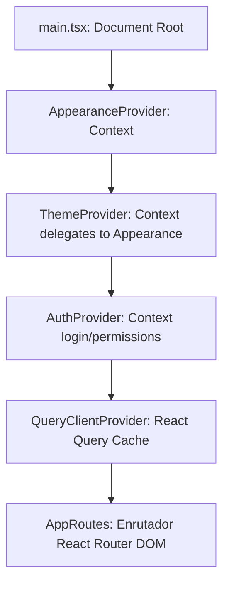
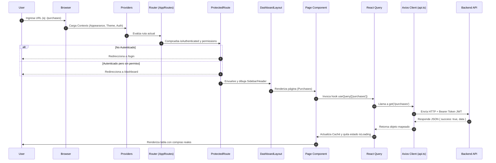

# PRESUERP - AI DEVELOPMENT KIT: FRONTEND ARCHITECTURE

Este documento constituye la documentación técnica oficial y de nivel empresarial de toda la arquitectura del **Frontend** de **PresuERP**. Cubre el flujo de ejecución, diseño de componentes, sistemas de enrutamiento integrado, capas de negocio en caché y la política de estilos interactivos multi-tenant.

---

## 1. INTRODUCCIÓN Y TECNOLOGÍAS

El frontend de PresuERP es una Single Page Application (SPA) construida en React y estructurada para garantizar accesos dinámicos basados en roles (RBAC) con un aislamiento multi-inquilino estricto.

### Ecosistema Tecnológico Detectado
*   **React v18**: Biblioteca base para el renderizado declarativo y reactivo.
*   **TypeScript**: Tipado consistente en modelos, payloads y respuestas API.
*   **Vite**: Motor compilador y empaquetador para desarrollo y build de producción.
*   **React Router DOM v6**: Administrador dinámico de rutas locales y layouts.
*   **Tanstack React Query (v4/v5)**: Capa de almacenamiento y revalidación de caché asíncrona de la API.
*   **Axios**: Cliente HTTP para consultas REST con inyección segura de cabeceras.
*   **React Hook Form**: Gestor optimizado de estados y submits de formularios.
*   **Zod**: Motor validador de tipos en formularios locales interactivos.

---

## 2. ARQUITECTURA GENERAL E INFRAESTRUCTURA

El frontend se acopla desacoplado del backend comunicándose exclusivamente mediante objetos JSON sobre HTTP.

```
┌────────────────────────────────────────────────────────┐
│               Presentación (Pages & Components)        │
├────────────────────────────────────────────────────────┤
│          Formularios (React Hook Form + Zod Resolvers) │
├────────────────────────────────────────────────────────┤
│          Caché y Sincronía (Tanstack React Query)      │
├────────────────────────────────────────────────────────┤
│          Llamadas de Red (Axios API Client Instance)   │
└──────────────────────────┬─────────────────────────────┘
                           │  Bearer Token JWT
                           ▼
                  [ Backend API REST ]
```

### Arquitectura de Inicialización (Jerarquía de Componentes)

Al arrancar, `main.tsx` inyecta a React y monta el árbol jerárquico de contextos y enrutamiento:



---

## 3. ESTRUCTURA COMPLETA DE CARPETAS Y RESPONSABILIDADES

La carpeta `erp/frontend/src` se organiza de forma estricta según las siguientes responsabilidades lógicas:

### `src/assets/`
*   **Propósito**: Almacenar imágenes fijas, logotipos vectoriales SVG y archivos multimedia locales.
*   **Qué no debe contener**: Código de componentes o lógica TypeScript.

### `src/components/`
*   **Propósito**: Contener los componentes visuales reutilizables de UI general de la aplicación.
    *   `src/components/ui/Button.tsx`: Botón genérico con soporte directo de variables cromáticas.
    *   Otros subdirectorios organizacionales albergan tarjetas (`Cards`), tablas (`Tables`), visualizadores de datos y layouts menores.
*   **Qué no debe contener**: Llamadas de consulta API directas o lógica de negocio transaccional específica de un módulo.

### `src/config/`
*   **Propósito**: Archivos de especificación estática.
    *   `menu.ts`: Registra de forma jerárquica el navbar lateral (`menuConfig`), asociando campos: `name`, `href`, `permission` y el icono `iconName`.

### `src/contexts/`
*   **Propósito**: Proveedores globales de estado interactivo (React Contexts).
    *   `AppearanceContext.tsx`: Gestiona el tono, acentos cromáticos, tipografía, densidad visual (`compact`, `normal`, `wide`) y bordes de la UI. Escribe en documento raíz `document.documentElement` y almacena en `localStorage` (`'presuerp-appearance'`).
    *   `ThemeContext.tsx`: Acopla el modo (`light`/`dark`) consumiendo directamente `AppearanceContext`.
    *   `AuthContext.tsx`: Verifica si existe sesión del operador, guarda el token temporal en memoria (`accessToken`) e inyecta la función `hasPermission`.

### `src/dialogs/`
*   **Propósito**: Cuadros y popups globales reutilizables independientes de los formularios de páginas (ejemplo: confirmación al borrar o cambiar proveedor).

### `src/hooks/`
*   **Propósito**: Centralización de custom hooks utilitarios transversales. Actúa como directorio estructural; actualmente vacío en el código real debido a que las vistas interactúan directamente con hooks de Tanstack Query o contextos nativos.

### `src/layouts/`
*   **Propósito**: Contenedores maestros de visualización.
    *   `DashboardLayout.tsx`: Contiene Sidebar de navegación responsive, Header centrado de perfil, botones de cambio de theme lumínico, notificaciones mockeadas y el área principal de contenido interactivo.

### `src/modals/`
*   **Propósito**: Modales interactivos específicos para inserción/edición de catálogos (ej: `ProductModal`, `PurchaseModal`) reutilizados en las pantallas.

### `src/pages/`
*   **Propósito**: Pantallas y vistas nucleares acopladas al enrutador (14 páginas reales mapeadas).
*   **Páginas reales existentes**: `Brands`, `Categories`, `Dashboard`, `Kardex`, `Login`, `NotFound`, `Products`, `Profile`, `Purchases`, `Settings`, `Stocks`, `Suppliers`, `Users`, `Warehouses`.

### `src/providers/`
*   **Propósito**: Carga general de envolventes técnicas inicializadores del sistema (ej: QueryClient y configuraciones de idioma).

### `src/routes/`
*   **Propósito**: Hub del enrutador central de la SPA. Estructura los guards públicos y protegidos basándose en roles RBAC.

### `src/services/`
*   **Propósito**: Clientes de API desacoplados que inyectan y solicitan datos HTTP utilizando Axios (ejemplo: `api.ts`, `purchase.service.ts`, `product.service.ts`).

### `src/styles/` & `src/themes/`
*   **Propósito**: Declaración del motor visual. Define clases responsive y mapeadores cromáticos para Dark, Light, Emerald y otras variantes del sistema de temas.

---

## 4. FLUJO COMPLETO DEL FRONTEND (LIFE CYCLE)



---

## 5. SISTEMA DE RUTAS Y GUARDAS DE NAVEGACIÓN

El ruteo se realiza en `src/routes/AppRoutes.tsx` combinando guards personalizados:

### Guard de Rutas Protegidas (`ProtectedRoute`)
Valida de forma estricta los accesos del operador autenticado:
*   Si `isLoading = true`, dibuja un spinner bloqueante.
*   Si `isAuthenticated = false`, redirige forzosamente a `/login` reemplazando el historial del navegador.
*   Si se especifica la propiedad `permission` (ej. `<ProtectedRoute permission="users:read">`) y la función `hasPermission(permission)` del `AuthContext` devuelve `false`, redirige al usuario a `/dashboard`.
*   Si el usuario cuenta con los permisos necesarios, renderiza el componente visual envuelto en la etiqueta del maquetado común: `return <DashboardLayout>{children}</DashboardLayout>;`.

### Guard de Rutas Públicas (`PublicRoute`)
Utilizado exclusivamente para vistas pre-autenticación (tales como `/login`):
*   Si detecta que el usuario ya posee un token autenticado en el almacenamiento del navegador, lo redirige automáticamente al `/dashboard`.

---

## 6. ESTRUCTURA COMPLETA DE PÁGINAS REALES DETECTADAS

| Página | Ruta Física | Permiso Requerido | Hooks / Servicios Clave | Finalidad / Objetivo |
| :--- | :--- | :--- | :--- | :--- |
| `Login` | `/login` | Público | `AuthContext` / `auth.service` | Inicio de sesión, hasheo local y almacenamiento del token. |
| `Dashboard` | `/dashboard` | Autenticado | `QueryClient` / `settings.service` | Panel principal que recopila datos rápidos de actividad. |
| `Profile` | `/profile` | Autenticado | `user.service` | Ajustes de cuenta individual del operador conectado. |
| `Settings` | `/settings` | `settings:read` | `settings.service` | Parámetros de moneda, foliadores e impresión del tenant. |
| `Users` | `/users` | `users:read` | `user.service` | CRUD de usuarios de la empresa y asignación de roles. |
| `Products` | `/products` | `products:read` | `product.service`, `category.service` | Control de catálogo de mercaderías e importes de precios. |
| `Categories` | `/categories`| `categories:read` | `category.service` | Administrador de clasificaciones para el catálogo de stock. |
| `Suppliers` | `/suppliers` | `suppliers:read` | `supplier.service` | Registro del pool de proveedores logísticos del negocio. |
| `Warehouses` | `/warehouses` | `warehouses:read` | `warehouse.service` | CRUD de depósitos físicos de la empresa. |
| `Stocks` | `/stocks` | `stocks:read` | `stock.service` | Visualizador consolidado de cantidad disponible por almacén. |
| `Kardex` | `/kardex` | `kardex:read` | `stockMovement.service` | Histórico inmutable y auditoría de egresos e ingresos de stock. |
| `Purchases` | `/purchases` | `purchases:read` | `purchase.service`, `supplier.service` | Registro y aprobación fiscal de compras con IVA y otros tributos. |
| `Brands` | Sin ruta activa| desvinculada | `brand.service` | Remanente lógico inactivo reemplazado por Proveedores. |
| `NotFound` | Comodín `*` | Autenticado | `Navigate` | Captura de rutas erróneas. |

---

## 7. CONTEXTOS FRONTEND (REACT CONTEXTS)

### `AuthContext`
*   **Estado**: `user` (objeto con email, rol y permisos) y `token`.
*   **Acciones**: `login()`, `logout()`, `hasPermission()`.
*   **Persistencia**: Salva datos en claves `'accessToken'` y `'user'` del `localStorage` para hidratar la sesión en cargas subsiguientes del navegador.

### `AppearanceContext`
*   **Estado**: Preferencias visuales del ERP (`themeMode`, `accentColor`, `density`, `borders`, `animations`, `fontSize`).
*   **Acciones**: `updatePreference()`.
*   **Persistencia**: Serializa en un string JSON guardado en `localStorage` bajo la etiqueta `'presuerp-appearance'`.

---

## 8. SERVICIOS Y CONFIGURACIÓN CLIENTE HTTP (AXIOS)

El cliente unificado vive en `src/services/api.ts`.
*   **Base URL**: Configurada de forma relativa mediante `/api/v1`.
*   **Header de Autenticación**: Intercepta de forma asíncrona cada petición y añade la cabecera:
```typescript
config.headers.Authorization = `Bearer ${localStorage.getItem('accessToken')}`;
```
*   **Renovación de Sesión (Refresh Interceptor)**:
    *   Si recibe un error con código de estado HTTP 401 y la petición no cuenta con el flag `_retry`, detiene las consultas encolándolas (`failedQueue`).
    *   Hace un llamado POST a `/api/v1/auth/refresh` enviando las cookies del navegador (`withCredentials: true`) para que el backend valide el Refresh Token HttpOnly.
    *   Al recibir el nuevo `accessToken`, actualiza el `localStorage` e inicia la re-ejecución de todas las peticiones que se encontraban encoladas.
    *   Si la recarga de sesión falla (ej: expiración pasadas las 7 jornadas), limpia el almacenamiento (`accessToken`, `user`) y redirige forzosamente al login: `window.location.href = '/login'`.

---

## 9. VALIDACIÓN DE CAMPOS Y FORMULARIOS (ZOD & REACT HOOK FORM)

Los formularios implementan validaciones locales basadas en la interacción inmediata del usuario, asegurando antes del submit a la API que las variables coincidan lógicamente con el contrato del backend.

*Ejemplo Real (Esquema de Producto)*:
```typescript
import { z } from 'zod';

export const productSchema = z.object({
  name: z.string().min(1, 'El nombre es requerido'),
  categoryId: z.string().min(1, 'Debe seleccionar una categoría'),
  supplierId: z.string().optional().nullable(),
  purchasePrice: z.coerce.number().min(0, 'El precio de compra no puede ser menor a cero'),
  profitMargin: z.coerce.number().min(0, 'El margen no puede ser negativo'),
  salePrice: z.coerce.number().min(0, 'El precio de venta no puede ser negativo'),
});
```

*Vinculación en Componente React*:
```typescript
const { register, handleSubmit, formState: { errors } } = useForm({
  resolver: zodResolver(productSchema),
  defaultValues: { profitMargin: 30 }
});
```

---

## 10. MULT-TENANT Y SEGURIDAD EN EL CLIENTE

El frontend mantiene el aislamiento multi-inquilino de forma transparente protegiéndose de manipulaciones:
*   **Aislamiento**: El frontend no almacena ni lee variables locales de `businessId` para operar. Esta variable nunca es inyectada en el cuerpo (body) de las peticiones POST/PUT del cliente React.
*   **Tratamiento Oculto**: El `businessId` es encapsulado e inyectado del lado del servidor al leer de forma exclusiva la firma del token seguro JWT extraído del request HTTP.
*   **Seguridad contra Inyecciones**: Toda salida de texto dinámico en React es enrutada por el motor de renderizado virtual del framework, escapando por defecto variables que pudieran derivar en ataques XSS de scripting cruzado.

---

## 11. SISTEMA CROMÁTICO DE TEMAS

El control visual del ERP utiliza variables nativas aplicadas dinámicamente en el objeto DOM raíz de la aplicación en correspondencia con el `AppearanceContext`:

*   **Identificador de Clases**:
    *   `theme-blue`, `theme-emerald`, `theme-purple`, `theme-orange`, `theme-midnight` determinan acentos.
    *   `font-size-small`, `font-size-large` recalcula el tamaño del texto.
    *   `density-compact` re-escala los paddings de tablas e inputs en la interfaz de pantalla.
    *   `animations-disabled` en el HTML inhibe las animaciones de transición gráfica.

---

## 12. GUÍA DE DESARROLLO E INTEGRACIÓN PARA DESARROLLADORES e IAs

### Cómo Agregar una Nueva Vista y Asociar su Ruta

Siga estrictamente este procedimiento dividido en 6 pasos para expandir el Frontend:

#### Paso 1: Definir Esquema de Zod y Tipado
En `src/types/` o directamente en un archivo de validación en la vista, cree su interfaz y reglas:
```typescript
// src/types/warehouse.ts
export interface Warehouse {
  id?: string;
  name: string;
  code: string;
}
```

#### Paso 2: Crear el Archivo de Servicio Axios
En `src/services/`, exponga el consumo de endpoints consumiendo el cliente común:
```typescript
// src/services/warehouse.service.ts
import api from './api';
import { Warehouse } from '../types/warehouse';

export const warehouseService = {
  list: async (): Promise<Warehouse[]> => {
    const response = await api.get('/warehouses');
    return response.data.data;
  },
  create: async (data: Warehouse): Promise<Warehouse> => {
    const response = await api.post('/warehouses', data);
    return response.data.data;
  }
};
```

#### Paso 3: Codificar la Pantalla (PageComponent) con React Query
En `src/pages/`, desarrolle la vista que renderiza la información:
```tsx
// src/pages/Warehouses.tsx
import React from 'react';
import { useQuery, useMutation, useQueryClient } from '@tanstack/react-query';
import { warehouseService } from '../services/warehouse.service';

export const Warehouses: React.FC = () => {
  const queryClient = useQueryClient();
  const { data: areas, isLoading } = useQuery(['warehouses'], warehouseService.list);

  if (isLoading) return <div className="p-8">Cargando depósitos...</div>;

  return (
    <div className="p-6">
      <h1 className="text-2xl font-bold mb-4">Módulo de Depósitos</h1>
      <table className="min-w-full divide-y divide-slate-200">
        <tbody>
          {areas?.map((w) => (
            <tr key={w.id}>
              <td className="px-6 py-4">{w.code} - {w.name}</td>
            </tr>
          ))}
        </tbody>
      </table>
    </div>
  );
};
```

#### Paso 4: Añadir la Nueva Ruta en el Router
Importe la página y añádala envuelta por el guard en `src/routes/AppRoutes.tsx`:
```tsx
import { Warehouses } from '../pages/Warehouses';
// Dentro de las rutas protegidas especificando el permiso RBAC:
<Route
  path="/warehouses"
  element={
    <ProtectedRoute permission="warehouses:read">
      <Warehouses />
    </ProtectedRoute>
  }
/>
```

#### Paso 5: Registrar la Navegación en el Menú Lateral
En `src/config/menu.ts`, declare la nueva opción para dibujarla dinámicamente en el Sidebar:
```typescript
{
  name: 'Depósitos',
  href: '/warehouses',
  permission: 'warehouses:read',
  iconName: 'Warehouse'
}
```
*Asegúrese de registrar el mapeo del icono correspondiente dentro de la función getIcon() en DashboardLayout.tsx.*

---

## 13. ANÁLISIS DE RIESGOS TÉCNICOS DETECTADOS

*   **Páginas Desconectadas en Router**: Enlaces del menú lateral del Sidebar apuntan a rutas como `/sales` y `/reports`. Como no hay rutas coincidentes en `AppRoutes.tsx`, navegar a las mismas gatilla la redirección comodín `<Route path="*" />`, enviando al operador a la página de error `NotFound` desorientando la interacción.
*   **Encolamiento y Redirección Brusca**: Si un token de refresco falla en el interceptor de Axios, el sistema remueve las credenciales y ejecuta un `window.location.href = '/login'`. Esto causa un refresco brusco de todo el navegador perdiendo estados volátiles en memoria no salvados por el usuario.
*   **Bypass de Permisos Administrator**: Dado que `hasPermission` concede autorización instantánea si el rol se valida contra la cadena `'Administrator'`, es crítico impedir por seguridad que roles secundarios del tenant cuenten con la potestad de autodeclararse con esta etiqueta.
