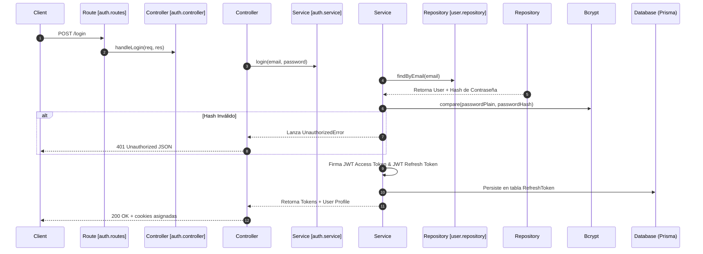

# PRESUERP - AI DEVELOPMENT KIT: AUTHENTICATION SYSTEM (AUTH)

Este documento detalla la especificación oficial y el funcionamiento del **Sistema de Autenticación** de **PresuERP**, abarcando la creación de inquilinos, login, control de vigencia mediante tokens de refresco, decodificación criptográfica y las reglas de integración multi-tenant.

---

## 1. INTRODUCCIÓN GENERAL Y OBJETIVOS

El módulo **Auth** es el núcleo de seguridad física de PresuERP. Sus responsabilidades comprenden:
*   **Aislamiento de Accesos**: Controlar el ingreso restringido identificando al usuario operador e inyectando implícitamente su tenant de pertenencia (`businessId`).
*   **Gobierno Multicapa**: Flujo acoplado a la clean architecture del backend que valida los esquemas en los controladores y delega la firma criptográfica a la capa de servicios.

---

## 2. ARQUITECTURA DE AUTENTICACIÓN



---

## 3. ESQUEMA Y VIGENCIA DE TOKENS

### Access Token (JWT)
*   **Vigencia**: 15 minutos (determinado por variable `JWT_EXPIRES_IN`).
*   **Firma**: Cifrado con la llave `JWT_SECRET`.
*   **Estructura del Payload Descifrado**:
```json
{
  "userId": "usr-8b9e672a-...",
  "email": "operador@empresa.com",
  "role": "Supervisor",
  "businessId": "biz-3f9e2b10-...",
  "permissions": [
    "products:read",
    "products:create",
    "purchases:read",
    "purchases:create"
  ]
}
```

### Refresh Token (Rotativo y Guardado en Base de Datos)
*   **Vigencia**: 7 días (determinado por variable `JWT_REFRESH_EXPIRES_IN`).
*   **Mecanismo de Rotación**:
    *   La API del backend valida el Refresh Token exponiéndolo sobre el modelo relacional `RefreshToken`.
    *   Al solicitar un refresco de sesión en POST `/auth/refresh`, el backend recupera el token del body u objeto de cookies relacionales, busca en base de datos compaginando tiempos de expiración y actualiza el campo `revoked: true` para anular la validez de la clave usada.
    *   Crea un nuevo token en la tabla y responde las nuevas llaves al cliente para impedir la reutilización de tokens en caso de interceptación ilegal.

---

## 4. MODELADO DE DATOS RELACIONADO (EN PRISMA)

El sistema de autenticación se sostiene físicamente sobre tres entidades en PostgreSQL via `schema.prisma`:

### Model `User`
```prisma
model User {
  id           String         @id @default(uuid())
  name         String
  email        String         @unique
  password     String
  isActive     Boolean        @default(true)
  businessId   String
  business     Business       @relation(fields: [businessId], references: [id], onDelete: Cascade)
  roleId       String
  role         Role           @relation(fields: [roleId], references: [id], onDelete: Restrict)
  refreshTokens RefreshToken[]
  createdAt    DateTime       @default(now())
  updatedAt    DateTime       @updatedAt
}
```

### Model `RefreshToken`
*   **Objetivo**: Trazabilidad del ciclo de vida del login y soporte de persistencia de refresco.
```prisma
model RefreshToken {
  id        String   @id @default(uuid())
  token     String   @unique
  userId    String
  user      User     @relation(fields: [userId], references: [id], onDelete: Cascade)
  revoked   Boolean  @default(false)
  expiresAt DateTime
  createdAt DateTime @default(now())
  updatedAt DateTime @updatedAt
}
```

---

## 5. CREACIÓN RELACIONAL DE TENANTS (STRATEGY BOOTSTRAP)

Al registrar una empresa nueva mediante `AuthService.registerBusinessTenant` se instrumenta un flujo atómico basado en una transacción Prisma (`$transaction`):

1.  **Validación de Claves Primarias**: Comprueba la inexistencia previa del identificador CUIT (`taxId`) y el correo del administrador.
2.  **Alta del Inquilino**: Persiste la cabecera en la entidad `Business`.
3.  **Permisos Modulares**: Recorre las 27 configuraciones del pool estático `whitelistPermissions` y realiza un upsert de los permisos en la base global compartida.
4.  **Roles Predeterminados del Tenant**: Crea los 3 roles básicos del inquilino asociando la llave primaria `businessId` para que pertenezcan en exclusiva a su espacio lógico:
    *   `Administrator` (Acceso absoluto a la gestión total de tiendas).
    *   `Supervisor` (Acceso operacional y de compras ampliado).
    *   `Cajero` (Ventas y facturadores rápidos).
5.  **Mapeo de Relaciones**: Asocia las llaves correspondientes en la tabla relacional `RolePermission` (ej. administrador recluta el total de permisos; Cajero una selección mínima de lectura y cierre de caja).
6.  **Hasheo de Contraseña**: Encriptado seguro usando `bcrypt` con 10 saltos.
7.  **Persistencia Final del Operador**: Da de alta al registro inicial vinculando el rol `Administrator` y el tenant correspondiente.

---

## 6. OBSERVACIONES TÉCNICAS Y RIESGOS

1.  **Expansión de la Lista de Permisos (`whitelistPermissions`)**: Cuando se añaden nuevos submódulos o endpoints a la API de PresuERP, se deben declarar de forma explícita sus strings en el pool estático `whitelistPermissions` dentro de `auth.service.ts` y correr el script `/AuthService.bootstrapPermissions()/` para actualizar las relaciones de los tenants preexistentes en la base PostgreSQL.
2.  **Políticas de Limpieza de Tokens Expirados**: La tabla `RefreshToken` añade un registro con cada interacción de inicio de sesión exitosa del software. Al no existir tareas programadas (cron jobs) de purga en el backend, la tabla acumulará registros de tokens expirados obsoletos exponencialmente, requiriendo mantenimiento o scripts secundarios.
