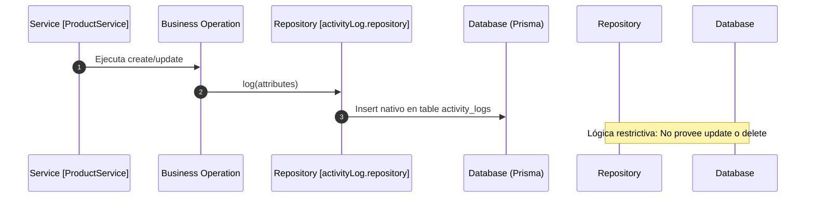

# PRESUERP - AI DEVELOPMENT KIT: AUDIT AND ACTIVITY LOGS SYSTEM

Este documento detalla la especificación oficial y el funcionamiento del **Sistema de Auditoría y Trazabilidad (Activity Logs)** de **PresuERP**, abarcando las firmas de persistencia de operaciones en base de datos PostgreSQL, la política de inmutabilidad física gobernada en la capa de datos, y los eventos integrados en los servicios comerciales.

---

## 1. INTRODUCCIÓN GENERAL Y OBJETIVOS

El módulo **Activity Logs** es la herramienta de trazabilidad corporativa de PresuERP. Registra de forma inalterable las acciones críticas ejecutadas por operarios humanos e interacciones automatizadas de servicios.

### Objetivos:
*   **Trazabilidad Transaccional**: Mantener un rastro detallado de las variaciones operativas y financieras del software.
*   **Garantía Multi-Tenant**: Vincular todos los registros operacionales a su empresa titular (`businessId`) para evitar filtración de metadatos de control empresarial entre inquilinos.

---

## 2. ARQUITECTURA DE AUDITORÍA Y FLUJO



---

## 3. MODELADO DE DATOS (EN PRISMA)

El modelo está definido de la siguiente manera en `schema.prisma`:

### Model `ActivityLog` (Físico postgres: `activity_logs`)
*   **Estructura del Modelo**:
```prisma
model ActivityLog {
  id             String   @id @default(uuid())
  businessId     String
  business       Business @relation(fields: [businessId], references: [id], onDelete: Cascade)
  userId         String?
  user           User?    @relation(fields: [userId], references: [id], onDelete: SetNull)
  action         String
  module         String
  entityId       String?
  previousValues String?  // Snapshot anterior stringified
  newValues      String?  // Snapshot posterior stringified
  ipAddress      String?
  userAgent      String?
  createdAt      DateTime @default(now())

  @@index([businessId, createdAt])
  @@index([businessId, module])
  @@map("activity_logs")
}
```

### Campos Clave e Inferencia Lógica:
1.  **`previousValues` / `newValues`**: Almacenan strings en formato JSON serializado (`JSON.stringify(payload)`) con las copias del registro antes y después de la mutación.
2.  **`module`**: String clasificador del módulo en donde ocurrió el evento (ej: `'products'`, `'purchases'`).
3.  **`userId` (Seguridad referencial `onDelete: SetNull`)**: Si un usuario administrador o cajero es eliminado físicamente del sistema, la integridad de Postgres setea el valor en `null` preservando inmaculada la fila de auditoría de logs históricos.

---

## 4. INMUTABILIDAD EN LA CAPA DE DATOS

*   **Principio de Auditoría**: Las tablas de logs de auditoría son inmutables de forma estricta. Todo update o delete sobre `activity_logs` está vetado.
*   **Control Físico**: `ActivityLogRepository` implementa exclusivamente el método `log` (Create). Al no proveer métodos `update` o `delete`, la capa de datos anula la posibilidad de manipulación o falsificación de registros de forma accidental o programada por el operador.
```typescript
// Estructura real de repositories/activityLog.repository.ts
export class ActivityLogRepository {
  async log(data: Omit<ActivityLog, 'id' | 'createdAt'>): Promise<ActivityLog> {
    return prisma.activityLog.create({ data });
  }
}
```

---

## 5. CAPTURA Y EVENTOS ADJUNTOS EN SERVICIOS

Los servicios nucleares de la API invocan a `ActivityLogRepository` de forma transaccional:

### 1. Histórico de Modificaciones en Catálogos (`ProductService`)
*   *Operación local*: Al actualizar precios o existencias del catálogo de mercaderías (`update`), capta el objeto recuperado antes del save y el nuevo resultado final.
*   *Inyección de Atributos*:
```typescript
await this.activityLogRepo.log({
  userId,
  businessId,
  action: 'PRODUCT_UPDATED',
  module: 'products',
  entityId: productId,
  previousValues: JSON.stringify(oldProductSnapshot),
  newValues: JSON.stringify(newProductSnapshot),
  ipAddress: null,
  userAgent: null
});
```

### 2. Aprobación y Costeos de Compras (`PurchaseService`)
*   *Operación local*: Al procesar y consolidar ingresos en stock mediante aprobación de facturas (`approve`), el sistema inyecta en `activity_logs` el autor de la firma, registrando los artículos afectados y los precios con IVA salvados.
*   *Log insertado*: `action: 'PURCHASE_APPROVED'`.

---

## 6. OBSERVACIONES TÉCNICAS Y RIESGOS

1.  **Falta de Captura Automática de IP y User Agent**: El esquema reserva las columnas `ipAddress` y `userAgent`. No obstante, en la capa de servicios los objetos invocan el registro enviando valores constantes `null`. Para dotar a la auditoría de valor empresarial, se debe inyectar la IP del cliente y la cabecera directamente desde los controladores Express (`req.ip` y `req.headers['user-agent']`).
2.  **Optimización sobre Datos en Formato Text**: Los campos `previousValues` y `newValues` se modelan lógicamente tipo `String?`. Postgres los interpreta físicamente como formato `Text`. Al no implementarse en tipo estructurado `Json` nativo de PostgreSQL, se limita la habilidad de construir queries de filtros condicionales rápidos e integraciones bi directas complejas dentro del administrador del motor SQL sin parseos secundarios pesados.
3.  **Bajo Impacto de Multi-Tenancy en Audits**: Dado que posee índices compuestos `@@index([businessId, createdAt])` y `@@index([businessId, module])`, el sistema responde con excelente desempeño ante queries de auditoría filtradas por inquilino.
