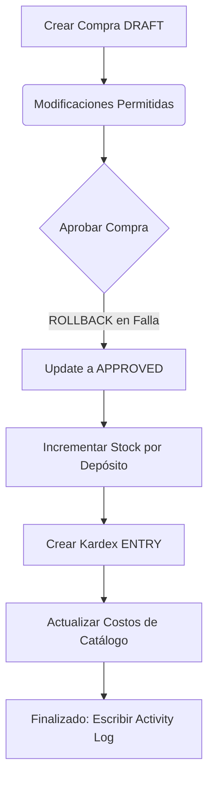

# PRESUERP - AI DEVELOPMENT KIT: SYSTEM WORKFLOWS

Este documento proporciona la especificación técnica y de desarrollo oficial de los **Flujos de Trabajo Nucleares (Workflows)** de **PresuERP**, detallando los ciclos de vida de compras, las transiciones lógicas del stock y el Kardex asociado, y el circuito operativo del mostrador POS.

---

## 1. INTRODUCCIÓN GENERAL Y OBJETIVOS

PresuERP opera estructurando flujos de estados estrictos para resguardar la lógica financiera y de inventario.
*   **Seguridad Operativa**: Evitar que el stock sufra alteraciones sin el sustento de un comprobante transaccional respaldatorio.
*   **Trazabilidad Financiera**: Definir el camino exacto que recorre cada mercadería desde su adquisición hasta su transformación en salida física de caja.

---

## 2. FLUJO DE COMPRAS (PURCHASE WORKFLOW)

La adquisición de insumos a proveedores sigue un ciclo estrictamente inalterable en el backend:

### Reglas de Transiciones en Compras:
1.  **DRAFT**: Estado inicial. El comprobante puede recibir adición o remoción de ítems, cambios de depósitosdestino o mutaciones en códigos fiscales. No altera la existencia en el stock físico ni escribe movimientos de Kardex.
2.  **APPROVED**: Ejecutado de forma única dentro de un bloque `prisma.$transaction`. Transiciona el estado de la compra e inyecta la existencia. Bloquea de forma definitiva cualquier re-edición del comprobante para auditoría.
3.  **CANCELLED**: Si la compra estaba previamente en DRAFT, se descarta directamente. Si ya estaba en estado APPROVED, el sistema ejecuta una transacción contraria: reduce las cantidades en la tabla `Stock` y genera un Kardex inverso para registrar el retorno.

---

## 3. FLUJO DE CAJA Y PUNTO DE VENTA (POS WORKFLOW)

El proceso diario de venta rápida en mostrador sigue esta automatización:
1.  **Validar Stock**: El backend inspecciona la tabla `Stock` contrastando la demanda de venta rápida.
2.  **Deducción y Cierre**: Si hay disponibilidad o el tenant permite balances negativos, la venta pasa a `CONFIRMED`. De forma atómica se reduce la existencia, escribe en Kardex (`StockMovement` tipo `EXIT`) y añade traza de auditoría.

---

## 4. OBSERVACIONES TÉCNICAS Y RIESGOS

1.  **Alineación de Columnas de Tenants**: La columna configurada físicamente en el motor PostgreSQL se llama strictly `businessId`. No debe codificarse bajo el concepto `tenantId` en la arquitectura de flujos para evitar leaks de visualización cruzada de transacciones.
2.  **Estado Parcial de Persistencia Ventas**: Dado el estado parcial del POS, las inserciones de las cabeceras `Sale` y `SaleItem` deben acoplarse con lógica de control transaccional previa a fin de evitar inconsistencias en el Kardex si la escritura del ticket de venta final falla a nivel de base.
3.  **Seguridad de Operarios**: Las consultas de usuarios del repositorio omiten el envío del hash de clave (`password`) en las selecciones ordinarias, derivando la validación del hash exclusivamente a las rutinas internas del login local en `AuthRepository`.
4.  **Bypass de System Roles**: Los roles bootstrapping (`isSystem = true`) no permiten re-programación de nombre o remoción física para prevenir que fallas operativas de base de datos alteren la inicialización básica de los inquilinos.
